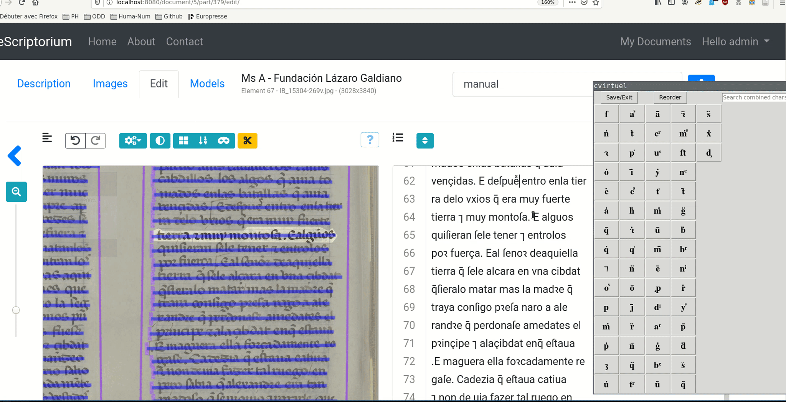

# Clavier virtuel


Ce programme permet d'afficher un clavier virtuel, conçu à faciliter la transcription
d'écritures manuscrites médiévales comprenant des abréviations et des caractères aujourd'hui
non utilisés. Il est utile en combinaison avec des outils comme eScriptorium par exemple 
([dépôt git](https://gitlab.inria.fr/scripta/escriptorium)).



## Installation

```
git clone https://gitlab.huma-num.fr/mgillelevenson/clavier_virtuel_transcription.git
cd clavier_virtuel_transcription
python3 -m venv env_clavier_virtuel chars/characters.graphematic.conf
source env_clavier_virtuel/bin/activate
pip3 install -r requirements.txt
```

Les caractères à représenter sont à ajouter au fichier `.conf`; ils doivent être séparés par des virgules.

## Utilisation

```
python3 cvirtuel.py
```

L'interface graphique apparaît, en cliquant sur chaque caractère, un compteur se 
déclenche, le caractère est copié dans le presse-papier et sera collé 0.5s après.

Le programme ajuste la position des caractères en fonction de la fréquence de 
leur utilisation.


## Citer ce dépôt

```
@softwareversion{gillelevenson:hal-03156769v1,
  TITLE = {{ClaViTranscr: clavier virtuel d'aide {\`a} la transcription de caract{\`e}re sp{\'e}ciaux.}},
  AUTHOR = {Gille Levenson, Matthias},
  URL = {https://hal.archives-ouvertes.fr/hal-03156769},
  YEAR = {2021},
  MONTH = Mar,
  VERSION = {v1.0.1},
  REPOSITORY = {https://gitlab.huma-num.fr/mgillelevenson/clavier_virtuel_transcription},
  LICENSE = {GNU Affero General Public License v3.0},
  KEYWORDS = {{\'e}criture manuscrite ; imprim{\'e}s modernes ; caract{\`e}res typographiques ; caract{\`e}res sp{\'e}ciaux ; transcription ; {\'e}criture manuscrite},
  FILE = {https://hal.archives-ouvertes.fr/hal-03156769/file/clavier_virtuel_transcription-v1.0.1.zip},
  HAL_ID = {hal-03156769},
  HAL_VERSION = {v1},
}
```

